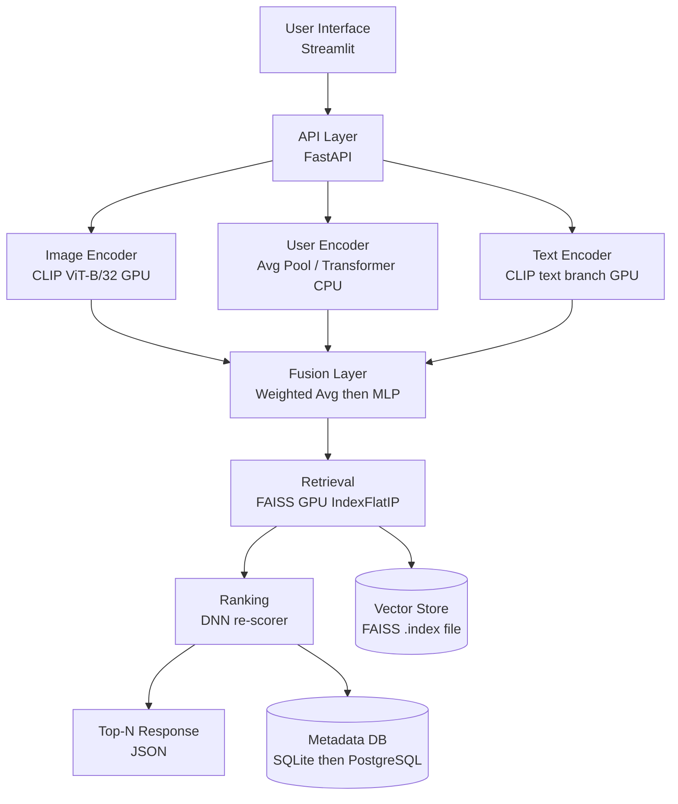

# Multimodal Recommender System — Master Design Document

---

## 1. Hardware Baseline (Locked Constraints)

| Resource     | Spec                          | Design Decision                              |
|--------------|-------------------------------|----------------------------------------------|
| GPU          | RTX 3060 12GB VRAM, CUDA 13.0 | CLIP on GPU, FAISS GPU index                 |
| CPU          | i7-12700, 20 threads          | DataLoader num_workers=8, batch preprocessing|
| RAM          | 16GB                          | Keep FAISS index on GPU, not RAM             |
| Disk         | 900GB+ available              | Full dataset storage (Amazon Reviews, ~20GB) |

VRAM budget:
- CLIP ViT-B/32 weights: ~1.5GB
- FAISS GPU index (1M items × 512-dim float32): ~2GB
- Training two-tower batch=128: ~4GB
- Total peak: ~8GB — stays within 12GB limit

---

## 2. System Architecture (High Level)



---

## 3. Tech Stack (Exact Versions)

```
python              3.10
torch               2.2.0+cu121
torchvision         0.17.0
clip                openai-clip (pip install git+https://github.com/openai/CLIP.git)
faiss-gpu           1.7.4 (conda install -c pytorch faiss-gpu)
fastapi             0.110.0
uvicorn             0.29.0
sqlalchemy          2.0.0
sqlite3             built-in (MVP), swap to PostgreSQL in Phase 2
streamlit           1.33.0
pillow              10.3.0
numpy               1.26.4
pandas              2.2.1
scikit-learn        1.4.2
tqdm                4.66.2
pydantic            2.6.0
```

---

## 4. Project Directory Structure

```
recommender/
│
├── data/
│   ├── raw/                    # downloaded dataset files
│   ├── images/                 # product images (resized to 224x224)
│   ├── metadata.db             # SQLite: products, users, interactions
│   └── processed/
│       ├── item_embeddings.npy # shape: (N, 512)
│       ├── item_ids.npy        # shape: (N,) — maps FAISS index row to product_id
│       └── user_history.json   # user_id -> [product_id, ...]
│
├── models/
│   ├── clip_encoder.py         # CLIP image + text encoding
│   ├── user_encoder.py         # user history -> user vector
│   ├── fusion.py               # combine user vector + image vector
│   ├── ranker.py               # DNN ranking model (Phase 2)
│   └── two_tower.py            # two-tower training (Phase 2)
│
├── retrieval/
│   ├── faiss_index.py          # build, save, load FAISS index
│   └── search.py               # query index, return top-K ids
│
├── api/
│   ├── main.py                 # FastAPI app, route definitions
│   ├── schemas.py              # Pydantic request/response models
│   └── db.py                   # SQLAlchemy session, CRUD helpers
│
├── pipeline/
│   ├── embed_items.py          # batch-encode all product images
│   ├── build_index.py          # build FAISS index from embeddings
│   └── simulate_users.py       # generate fake interaction logs (MVP)
│
├── ui/
│   └── app.py                  # Streamlit frontend
│
├── notebooks/
│   ├── 01_data_exploration.ipynb
│   ├── 02_clip_embeddings.ipynb
│   └── 03_retrieval_eval.ipynb
│
├── tests/
│   ├── test_encoder.py
│   ├── test_faiss.py
│   └── test_api.py
│
├── config.py                   # all constants, paths, hyperparameters
├── requirements.txt
└── README.md
```

---

## 5. Data Schema

### products table (SQLite / PostgreSQL)

| Column       | Type    | Notes                          |
|--------------|---------|--------------------------------|
| product_id   | TEXT PK | unique string ID               |
| title        | TEXT    |                                |
| category     | TEXT    |                                |
| price        | REAL    |                                |
| image_path   | TEXT    | relative path under data/images|
| description  | TEXT    | used by text encoder           |

### users table

| Column    | Type    | Notes |
|-----------|---------|-------|
| user_id   | TEXT PK |       |
| created_at| INTEGER | unix timestamp |

### interactions table

| Column       | Type    | Notes                              |
|--------------|---------|------------------------------------|
| interaction_id | INT PK | autoincrement                    |
| user_id      | TEXT FK |                                    |
| product_id   | TEXT FK |                                    |
| event_type   | TEXT    | click / purchase / view            |
| timestamp    | INTEGER | unix timestamp                     |
| weight       | REAL    | click=0.3, view=0.1, purchase=1.0  |

---

## 6. Component Specifications

### 6.1 CLIP Encoder (models/clip_encoder.py)

- Model: ViT-B/32 loaded once at startup, kept on GPU
- Input (image): PIL Image or file path -> preprocess -> (1, 3, 224, 224) tensor
- Input (text): string -> clip.tokenize -> tensor
- Output: 512-dim L2-normalised float32 numpy vector
- Batch encoding: process in chunks of 64 images per forward pass
- Do not reload model per request — load once in FastAPI lifespan event

```
encode_image(image_path: str) -> np.ndarray shape (512,)
encode_text(text: str)        -> np.ndarray shape (512,)
encode_batch(paths: list)     -> np.ndarray shape (N, 512)
```

### 6.2 User Encoder (models/user_encoder.py)

Phase 1 (MVP):
- Load user's last 20 interacted product_ids from interactions table
- Fetch their pre-computed item embeddings from item_embeddings.npy
- Weight by interaction weight column
- Return weighted average -> 512-dim vector

Phase 2 (Advanced):
- Replace weighted average with a 2-layer Transformer
- Input: sequence of item embeddings ordered by timestamp
- Output: CLS token embedding -> 512-dim vector
- Train jointly with two-tower loss

```
encode_user(user_id: str, db_session) -> np.ndarray shape (512,)
```

### 6.3 Fusion Layer (models/fusion.py)

Phase 1 (MVP):
```
final_vector = 0.6 * user_vector + 0.4 * query_image_vector
final_vector = final_vector / np.linalg.norm(final_vector)
```

Phase 2:
- Concatenate [user_vector, image_vector, text_vector] -> 1536-dim
- Pass through MLP: Linear(1536, 512) -> ReLU -> Linear(512, 512) -> L2 norm
- Train MLP end-to-end with retrieval loss

```
fuse(user_vec, image_vec, text_vec=None) -> np.ndarray shape (512,)
```

### 6.4 FAISS Index (retrieval/faiss_index.py)

Phase 1 (MVP):
- Index type: IndexFlatIP (exact inner product, GPU)
- Vectors must be L2-normalised before insert (converts inner product to cosine)
- Build: load item_embeddings.npy -> transfer to GPU -> add to index -> save

Phase 2:
- Index type: IndexIVFPQ (approximate, compressed)
  - nlist=256 (number of Voronoi cells)
  - m=64 (PQ subvectors), nbits=8
  - nprobe=32 at query time
- Required: train index on ~10k sample vectors before adding all vectors
- Reduces memory from ~2GB to ~200MB for 1M items

```
build_index(embeddings: np.ndarray) -> faiss.Index
save_index(index, path: str)
load_index(path: str)             -> faiss.Index (moved to GPU)
search(index, query_vec, k=100)   -> (distances, indices) both shape (k,)
```

### 6.5 Ranking Layer (models/ranker.py) — Phase 2 only

- Input per candidate: concat [user_vec(512), item_vec(512), delta_vec(512), price(1), category_id(1)] = 1538-dim
- Architecture: Linear(1538, 256) -> ReLU -> Dropout(0.2) -> Linear(256, 64) -> ReLU -> Linear(64, 1) -> Sigmoid
- Loss: BPR (Bayesian Personalised Ranking) pairwise loss
- Training: use interactions table, positives = purchases, negatives = views without purchase
- Output: scalar score per candidate -> sort top-100 -> return top-10

---

## 7. API Endpoints (api/main.py)

```
POST /recommend/image
  Body: { user_id: str, image: base64 string, top_k: int = 10 }
  Returns: [{ product_id, title, score, image_url }]

POST /recommend/text
  Body: { user_id: str, query: str, top_k: int = 10 }
  Returns: [{ product_id, title, score, image_url }]

POST /recommend/hybrid
  Body: { user_id: str, image: base64|null, query: str|null, top_k: int = 10 }
  Returns: [{ product_id, title, score, image_url }]

GET /product/{product_id}
  Returns: full product record from DB

POST /interaction
  Body: { user_id: str, product_id: str, event_type: str }
  Returns: { ok: true }

GET /health
  Returns: { status: ok, index_size: int, model: str }
```

All endpoints return HTTP 200 on success, 422 on validation error, 500 on model failure.

---

## 8. Data Pipeline Execution Order

Run these scripts once before starting the API server:

```
Step 1: python pipeline/simulate_users.py
        -- populates users and interactions tables with fake data
        -- 1000 users, 10000 products, 50000 interactions

Step 2: python pipeline/embed_items.py
        -- loads all product images from data/images/
        -- encodes in batches of 64 on GPU using CLIP
        -- saves item_embeddings.npy and item_ids.npy to data/processed/
        -- expected runtime: ~15 min for 10k images on RTX 3060

Step 3: python pipeline/build_index.py
        -- loads item_embeddings.npy
        -- builds FAISS IndexFlatIP on GPU
        -- saves to data/processed/faiss.index
        -- expected runtime: < 30 seconds for 10k items

Step 4: uvicorn api.main:app --host 0.0.0.0 --port 8000 --reload
        -- loads CLIP and FAISS index into memory once at startup
        -- ready to serve requests
```

---

## 9. config.py (All Constants in One Place)

```python
# Paths
DATA_DIR         = "data"
IMAGE_DIR        = "data/images"
PROCESSED_DIR    = "data/processed"
EMBEDDINGS_PATH  = "data/processed/item_embeddings.npy"
ITEM_IDS_PATH    = "data/processed/item_ids.npy"
FAISS_INDEX_PATH = "data/processed/faiss.index"
DB_PATH          = "data/metadata.db"

# Model
CLIP_MODEL_NAME  = "ViT-B/32"
EMBEDDING_DIM    = 512
CLIP_BATCH_SIZE  = 64
IMAGE_SIZE       = 224

# Retrieval
FAISS_TOP_K      = 100    # candidates retrieved before re-ranking
FINAL_TOP_N      = 10     # results returned to user
FAISS_USE_GPU    = True

# User encoder
MAX_HISTORY_LEN  = 20
INTERACTION_WEIGHTS = { "purchase": 1.0, "click": 0.3, "view": 0.1 }

# Fusion (Phase 1)
USER_WEIGHT      = 0.6
IMAGE_WEIGHT     = 0.4

# Training (Phase 2)
LEARNING_RATE    = 1e-4
BATCH_SIZE       = 128
EPOCHS           = 20
DEVICE           = "cuda"
```

---

## 10. Evaluation Metrics

| Metric       | Description                                     | Target (MVP) |
|--------------|-------------------------------------------------|--------------|
| Recall@10    | % of relevant items in top-10 retrieved         | > 0.30       |
| NDCG@10      | normalised ranking quality                      | > 0.25       |
| Latency p99  | end-to-end API response time                    | < 200ms      |
| Index build  | time to embed + index 10k items                 | < 20 min     |

Evaluate using 80/20 train/test split on interactions table. Hold out last interaction per user as test positive.

---

## 11. Build Phases

### Phase 1 — MVP (target: 2 weeks)

- [ ] Set up directory structure and config.py
- [ ] Download Amazon Product Reviews dataset (small subset, ~10k items)
- [ ] Resize and store images to data/images/
- [ ] Implement clip_encoder.py — encode_image, encode_text, encode_batch
- [ ] Run embed_items.py — generate item_embeddings.npy
- [ ] Implement faiss_index.py — IndexFlatIP, save/load
- [ ] Run build_index.py
- [ ] Implement user_encoder.py — weighted average (Phase 1 version)
- [ ] Implement fusion.py — weighted average (Phase 1 version)
- [ ] Implement api/main.py — /recommend/image and /health endpoints
- [ ] Implement ui/app.py — image upload + result display in Streamlit
- [ ] Write test_encoder.py and test_faiss.py

### Phase 2 — Advanced (target: 4–6 weeks after Phase 1)

- [ ] Replace IndexFlatIP with IndexIVFPQ for scale
- [ ] Implement two_tower.py — joint training of user/item towers
- [ ] Replace weighted-avg user encoder with Transformer sequence model
- [ ] Implement ranker.py — DNN re-scorer with BPR loss
- [ ] Add /recommend/hybrid endpoint
- [ ] Swap SQLite for PostgreSQL
- [ ] Add A/B test simulation: compare Phase 1 vs Phase 2 NDCG@10
- [ ] Add logging middleware to interactions table per request

---

## 12. Known Failure Points and Fixes

| Failure                         | Cause                               | Fix                                          |
|---------------------------------|-------------------------------------|----------------------------------------------|
| FAISS OOM on GPU                | Too many vectors for VRAM           | Use IndexIVFPQ or move to CPU IndexFlatIP    |
| CLIP slow on first request      | Model cold start                    | Load model in FastAPI startup lifespan event |
| User vector is zero             | New user with no history            | Fall back to image-only query vector         |
| Retrieval returns duplicates    | Same item embedded twice            | Deduplicate item_ids.npy before indexing     |
| Embeddings not normalised       | Cosine sim fails silently           | Always L2-normalise before FAISS insert      |
| API timeout on large image      | Encoding takes > 1s                 | Cap input image at 1024px, resize before encode|

---

End of document.